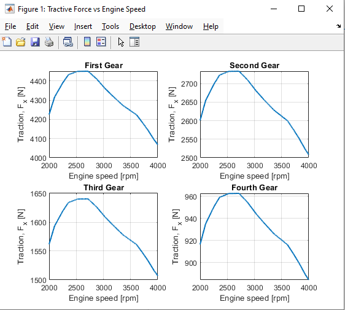

# Vehicle Dynamics - Driveline Simulation 🚗⚙️

This repository contains a complete MATLAB and Simulink simulation model for analyzing the longitudinal dynamics and driveline performance of a front-wheel-drive vehicle.

## 📌 Project Overview
The primary goal of this project is to model the driveline system of a vehicle using an engine torque-speed map and to calculate the **Tractive Force ($F_x$)** transmitted to the wheels across four different gear ratios. 

The simulation calculates the inertia losses (engine, transmission, driveshaft, and wheels) and applies the longitudinal dynamics equations to generate an automated 2x2 subplot of Engine Speed [rpm] vs. Tractive Force [N].

## 📊 Vehicle Specifications
* **Vehicle Mass ($m$):** 830 kg
* **Effective Wheel Radius ($R_w$):** 257 mm
* **Transmission Efficiency ($\eta_t$):** 0.91
* **Final Drive Ratio ($N_f$):** 1 / 0.2884
* **Longitudinal Acceleration ($a_x$):** 1 $m/s^2$

## 📂 Repository Structure
* `hw5.m`: The main MATLAB script that initializes the vehicle parameters, calculates inertia terms, automates the Simulink simulation for 4 distinct gears, and plots the results.
* `hw5_simulink.slx`: The Simulink block diagram modeling the driveline system and traction physics.
* `engine_T-omega_Genta_veh1__data.mat`: The empirical engine map dataset containing Engine Speed (RPM) and Engine Torque (Nm) arrays.
* `gears_graphs.png`: The final output graph demonstrating the simulation results.

## 🚀 How to Run
1. Clone the repository to your local machine.
2. Open MATLAB and set the repository folder as your Current Folder.
3. Open `hw5.m` and run the script.
4. The script will automatically load the engine data, pass the required transfer functions to the Simulink model (`hw5_simulink.slx`), and generate the final subplots.

## 📈 Results
Below is the output generated by the simulation, showing the Tractive Force behavior as engine speed increases from 2000 to 4000 RPM for all four forward gears.

